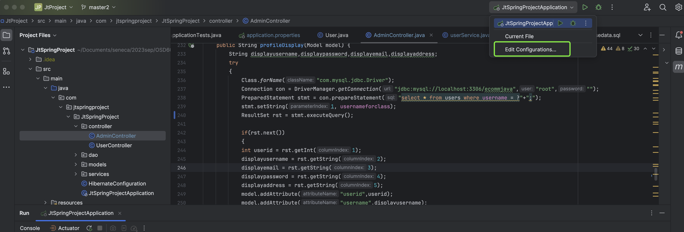

## Old Version
- https://github.com/jaygajera17/E-commerce-project-springBoot/tree/main
- issue: everytime connection open close for access database 

## New Version ( what's new)
- Hibernate configuration added( database and tables automatically create when run the project)
- Service classes provide reusable services throughout project
- dao classes interact with database 
- bug fixed ( product image, security , etc..)
- support in both eclipse & intellij ide
- overall redesign entire code that help reusability. 
- disclaimer: currently working on this branch so there may be some bug related to endpoint, and working on cart logic.
  
## Quickstart

1. Clone the repository
2. Open the project in your IDE: IntelliJ IDEA (recommended) or Eclipse
    * If you are using IntelliJ IDEA, make sure the IDE opens project as **Maven** and recognizes the project as a Spring Boot project. Also, you must change the working directory of the project so that the views (the actual web pages to be shown) are found by Spring Boot (check out [Web Directories IntelliJ IDEA](#web-directories).
3. Make sure you are in the `JtProject` directory
4. Configure the database connection in `application.properties` file (check the [Database](#database) section below for more info)
5. Run the project (by running the `main` method in `JtSpringProjectApplication.java`)
6. Open http://localhost:8080/ in your browser!
   * If you ran the [`basedata.sql`](https://github.com/jaygajera17/E-commerce-project-springBoot/blob/master2/JtProject/basedata.sql)script on the database, you can log in with the following credentials as admin; otherwise you'll have to manually create an admin user in the database:
     * Username: `admin`
     * Password: `123`
   * Log in as a normal user:
     * Username: `lisa`
     * Password: `765`

### Database

MySQL or MariaDB can be used as the database for this project. The database connection can be configured in the `src/main/resources/application.properties` file, with the appropriate values for the following properties:

**( You'd better use another username not root, and ensure that the user has the corresponding permissions for the database. )**

```properties
    db.url=jdbc:mysql://[ip address of db]:[port of db]/ecommjava?createDatabaseIfNotExist=true
    db.username=[username]
    db.password=[password, if any]
```

if you met the error `java.lang.IllegalArgumentException: Could not resolve placeholder 'db.driver' in value "${db.driver}"`, maybe you should change your `mysql-connector-java` version in `pom.xml` file according to your mysql version, don't forget to reload your Maven project.

Having done that, you must create some base data in the database. You can do that by running the `basedata.sql` script on the database. Check out Google for how to do that, because it depends on what tool you are using to access said database. 

### Web Directories

The views are located in `src/main/webapp/views`, but for some reason, Spring Boot doesn't recognize that directory. To remedy this, you must change the working directory of the project in your IDE. If you're using IntelliJ IDEA, follow these steps:

1. Click on the "Edit Configurations..." button in the top right corner of the IDE
2. Click on the `JtSpringProjectApplication` configuration
3. Change the "Working directory" option (if not present, click on "Modify Options" and select from the list) to the `$MODULE_WORKING_DIR$` macro
4. Click "Apply" and "OK"


When you run the project, the views should be found by Spring Boot and you should see a login page in http://localhost:8080/ (if not logged in previously)!


# Workflow
- 
### Controller
- control the endpoint and also send data to view( we use ModelAndView method)
- ``` @GetMapping("login")
	public String adminlogin() {
		
		return "adminlogin";
	}```
- whenever /login url is hit , src->main->webapp-> adminlogin.jsp file execute
### Models
- represent data as entity and relationship among them.

### View
- receive data from controller and show with frontend.

## Endpoints
- http://localhost:8080/
- http://localhost:8080/register
- http://localhost:8080/admin/products
- http://localhost:8080/admin/customers
- http://localhost:8080/admin/categories
- http://localhost:8080/admin/Dashboard


## Spring Boot

For any information about Spring Boot, here are some useful links!

### Reference Documentation
For further reference, please consider the following sections:

* [Official Apache Maven documentation](https://maven.apache.org/guides/index.html)
* [Spring Boot Maven Plugin Reference Guide](https://docs.spring.io/spring-boot/docs/2.6.4/maven-plugin/reference/html/)
* [Create an OCI image](https://docs.spring.io/spring-boot/docs/2.6.4/maven-plugin/reference/html/#build-image)
* [Spring Web](https://docs.spring.io/spring-boot/docs/2.6.4/reference/htmlsingle/#boot-features-developing-web-applications)

### Guides
The following guides illustrate how to use some features concretely:

* [Building a RESTful Web Service](https://spring.io/guides/gs/rest-service/)
* [Serving Web Content with Spring MVC](https://spring.io/guides/gs/serving-web-content/)
* [Building REST services with Spring](https://spring.io/guides/tutorials/bookmarks/)

## Preview


## Link
- 𝗬𝗼𝘂𝘁𝘂𝗯𝗲 𝗽𝗿𝗼𝗷𝗲𝗰𝘁 𝘃𝗶𝗱𝗲𝗼 𝗪𝗼𝗿𝗸𝗶𝗻𝗴 𝗗𝗲𝗺𝗼 + 𝘀𝘁𝗲𝗽 𝗯𝘆 𝘀𝘁𝗲𝗽 𝗲𝘅𝗲𝗰𝘂𝘁𝗶𝗼𝗻 𝗹𝗶𝗻𝗸  ( old version )::---  [  click here  ](https://youtu.be/c6WWdINWSlI) [![youtube][youtube-shield]][youtube-url]

[youtube-shield]:https://img.shields.io/youtube/views/c6WWdINWSlI?style=social
[youtube-url]:  https://youtu.be/c6WWdINWSlI
